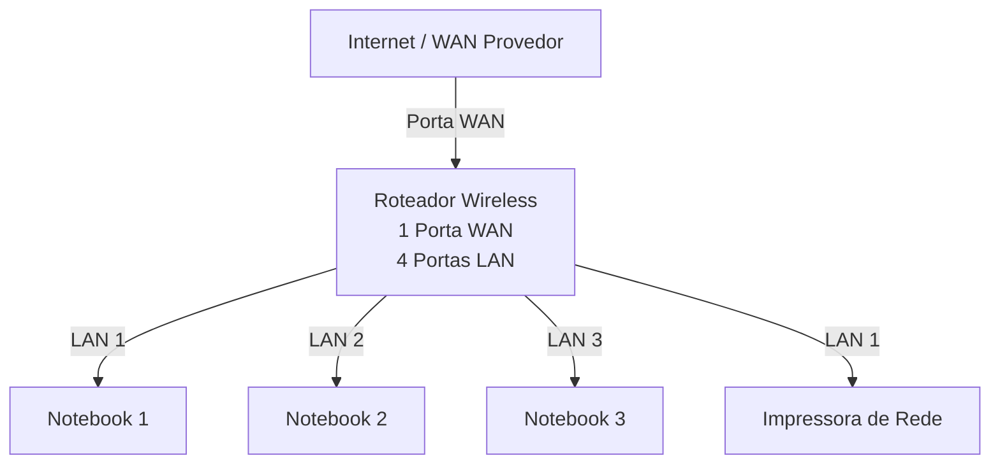
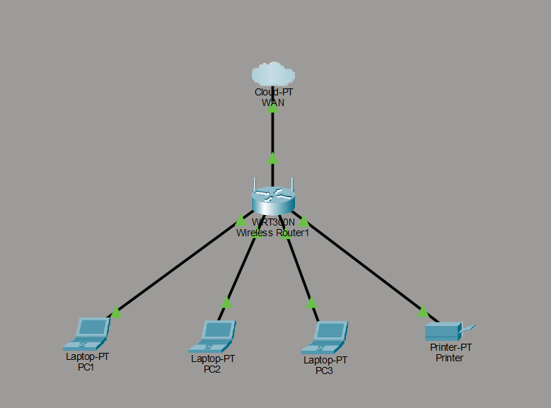

# Laboratório de Redes 01 - Projeto de Rede Local
Projeto desenvolvido na disciplina de Redes de Computadores no Curso Técnico de Informática do SENAC.

Aluno: Bruss Loza

Professor: José de Assis

Data 09/03/2026

---

## 1. Objetivo
Implementar uma rede local simples conectando três notebooks a um roteador wireless com switch integrado e uma impressora de rede.

O projeto será realizado em duas etapas

1. Simulação da rede no Cisco Packet Tracer
2. Implementação da rede laboratório real

---

## 2. Equipamentos utilizados neste laboratório

- 3 notebooks
- 1 roteador wireless com 1 porta WAN e 4 portas LAN
- 1 impressora de rede
- Cabos de rede

---

## 3. Topologia da Rede
Diagrama lógico da rede utilizada neste laboratório:

Imagem da topologia utilizada no laboratório:

---

